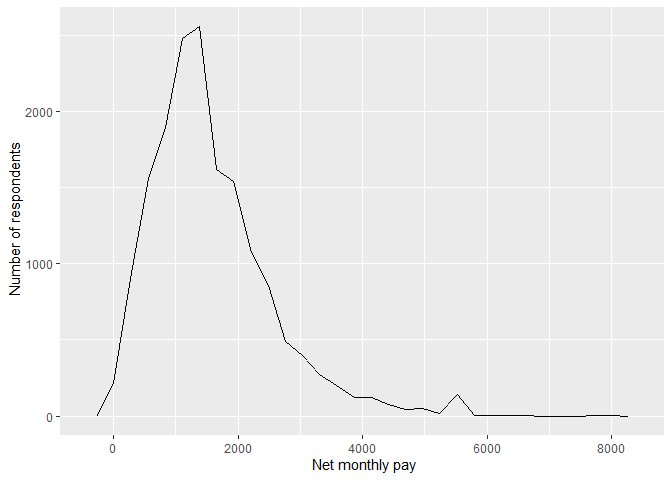
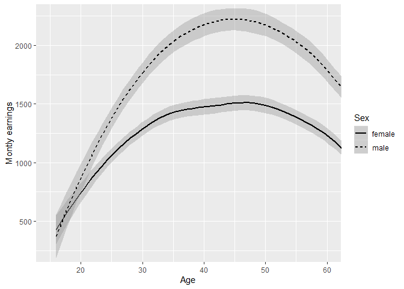
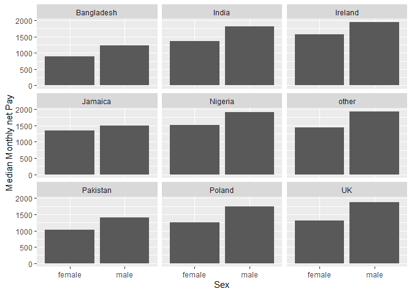
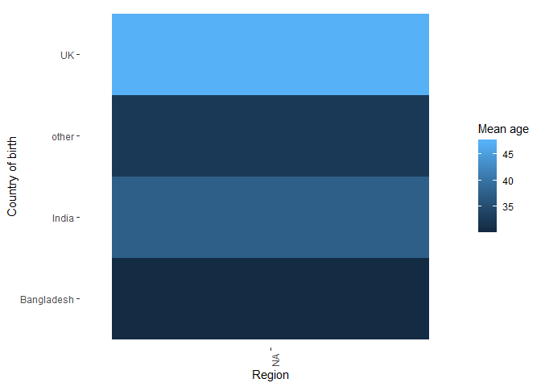
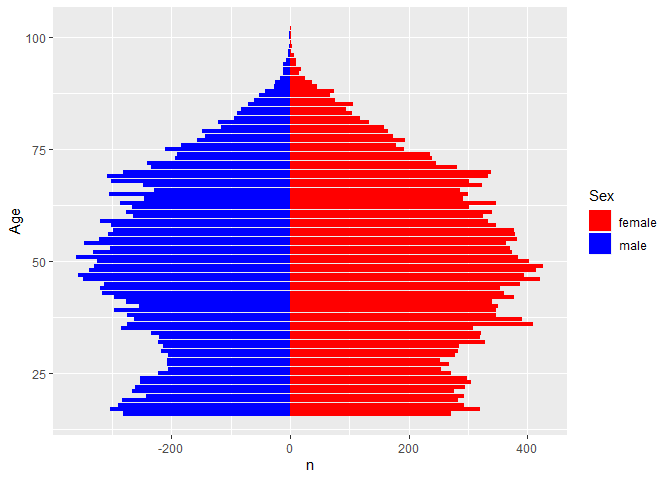

Statistical assignment 4
================
\[Emilia Cook 670005042\]
\[29/02/2020\]

In this assignment you will need to reproduce 5 ggplot graphs. I supply
graphs as images; you need to write the ggplot2 code to reproduce them
and knit and submit a Markdown document with the reproduced graphs (as
well as your .Rmd file).

First we will need to open and recode the data. I supply the code for
this; you only need to change the file paths.

    ```r
    library(tidyverse)
    Data8 <- read_tsv("/Users/emili/Documents/Data SOC Term 2 Year 2/UKDA-6614-tab/tab/ukhls_w8/h_indresp.tab")
    Data8 <- Data8 %>%
        select(pidp, h_age_dv, h_payn_dv, h_gor_dv)
    Stable <- read_tsv("/Users/emili/Documents/Data SOC Term 2 Year 2/UKDA-6614-tab/tab/ukhls_wx/xwavedat.tab")
    Stable <- Stable %>%
        select(pidp, sex_dv, ukborn, plbornc)
    Data <- Data8 %>% left_join(Stable, "pidp")
    rm(Data8, Stable)
    Data <- Data %>%
        mutate(sex_dv = ifelse(sex_dv == 1, "male",
                           ifelse(sex_dv == 2, "female", NA))) %>%
        mutate(h_payn_dv = ifelse(h_payn_dv < 0, NA, h_payn_dv)) %>%
        mutate(h_gor_dv = recode(h_gor_dv,
                         `-9` = NA_character_,
                         `1` = "North East",
                         `2` = "North West",
                         `3` = "Yorkshire",
                         `4` = "East Midlands",
                         `5` = "West Midlands",
                         `6` = "East of England",
                         `7` = "London",
                         `8` = "South East",
                         `9` = "South West",
                         `10` = "Wales",
                         `11` = "Scotland",
                         `12` = "Northern Ireland")) %>%
        mutate(placeBorn = case_when(
                ukborn  == -9 ~ NA_character_,
                ukborn < 5 ~ "UK",
                plbornc == 5 ~ "Ireland",
                plbornc == 18 ~ "India",
                plbornc == 19 ~ "Pakistan",
                plbornc == 20 ~ "Bangladesh",
                plbornc == 10 ~ "Poland",
                plbornc == 27 ~ "Jamaica",
                plbornc == 24 ~ "Nigeria",
                TRUE ~ "other")
        )
    ```

Reproduce the following graphs as close as you can. For each graph,
write two sentences (not more\!) describing its main message.

1.  Univariate distribution (20 points).
    
    ``` r
    library(ggplot2)
    
    ggplot(Data,
           aes(x= h_payn_dv))+
        geom_freqpoly()+
        xlim(-100, 9000)+
        xlab(" Net monthly pay")+
        ylab(" Number of respondents")+
        scale_x_continuous(breaks=seq(0,9000, by=2000))
    ```
    
    <!-- -->

The main message of this graph is that a large amount of the respondents
from the Understanding society data recieved a monthly pay of
£500-£2000. 2. Line chart (20 points). The lines show the
non-parametric association between age and monthly earnings for men and
women.

    ```r
    AgeSex <- Data %>%
        filter(!is.na(sex_dv)) %>%
        group_by(h_age_dv, sex_dv) %>%
        summarise( meanPay= mean(h_payn_dv, na.rm=TRUE))
    
    AgeSex %>%
        ggplot(mapping= aes(x=h_age_dv, y= meanPay, linetype = sex_dv)) +
        geom_smooth(colour="black")+
        scale_x_continuous(breaks=seq( 20,60, by=10)) +
        coord_cartesian(xlim = c(15,60), ylim=c(250,2250))+
        xlab("Age")+
        ylab("Montly earnings")+
        labs(linetype="Sex")
    ```
    
    <!-- -->

The main message of this line chart is that on average men will earn
more than women per montly earnings. The gap is narrow up until age 20
but continues to increase with the largest gap being around 45 years of
age 3. Faceted bar chart (20 points).

    ```r
    BirthPlace <- Data %>%
        filter(!is.na(sex_dv)) %>%
        group_by(sex_dv, placeBorn) %>%
        summarise(medianPay = mean(h_payn_dv, na.rm=TRUE))
    
    BirthPlace %>%
        drop_na(placeBorn)%>%
        ggplot()+
        geom_bar(mapping=aes(x=sex_dv, y=medianPay), stat= "identity")+
        facet_wrap(~placeBorn, ncol = 3)+
        ylab("Median Monthly net Pay")+
        xlab("Sex")
    ```
    
    <!-- -->

These graphs show that on average women will earn less than men on
average in a number of countries in both developing and developed
countries. 4. Heat map (20 points).

    ```r
    Age<- Data %>%
        filter(is.na(h_gor_dv)) %>%
        group_by(h_gor_dv, placeBorn) %>%
        summarise(
            mean=mean(h_age_dv, na.rm= TRUE)
        )
    
    
    ggplot(data = Age, aes(x = h_gor_dv, y = placeBorn)) +
      geom_raster(aes(fill = mean)) +
      labs(
    y = "Country of birth", 
    x = "Region", 
    fill = "Mean age"
      ) +
      theme_bw() +
      theme(panel.grid = element_blank(),
        panel.border = element_blank()
        ) +
      theme(axis.text.x = element_text(angle = 90, hjust = 1))
    ```
    
    <!-- -->

The heat map shows that in different regions of the UK, the mean age
depends on the country of birth. This indciates that in general the
average of the uk is around 50. 5. Population pyramid (20 points).

The population pyramid main message is that there is an equal
distrubtion of male and females in the Understanding Society Data. With
the highest number of particpants being between the ages of 35 and 50.

    ```r
    pyramid <- Data %>%
        group_by(sex_dv, h_age_dv) %>%
        count(h_age_dv, sex_dv)
    
    pyramid$n <- ifelse(pyramid$sex_dv=="male", -1*pyramid$n, pyramid$n)
    
    ggplot(pyramid, aes(x=h_age_dv, y=n, fill= sex_dv))+
    geom_bar(data= subset(pyramid, sex_dv=="female"), stat="identity")+
    geom_bar(data=subset(pyramid, sex_dv== "male"), stat= "identity")+
    labs(fill="Sex")+
    coord_flip()+
    scale_fill_manual(values=c("red", "blue"))+
    xlab("Age")
    ```
    
    <!-- -->
